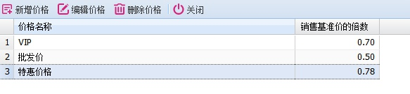
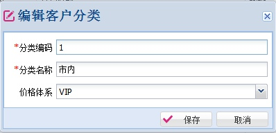
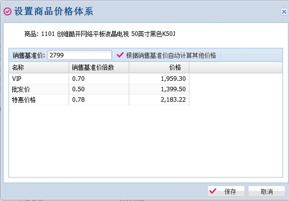

# 价格体系

---

通过实施价格体系，销售的时候可以实现对不同的客户采用不同的价格。
实施价格体系的步骤：
1、 在“基础数据\商品\价格体系”模块中制定价格基础数据。下图是一个示例。

通过设置销售基准价的倍数可以在商品中通过设置基准价快速计算出各个价格。

2、 在客户资料的客户分类中设置价格体系。

这样该客户分类下的所有客户就使用对应的价格。
没有设置价格体系的客户，销售的时候使用商品的销售基准价。

3、 在商品中设置具体商品的价格

各个价格既可以通过销售基准价倍数自动计算出来，也可以手工填写。
手工填写的价格，就和基准价格以及倍数无关。

在实施中，如果没有设置商品该价格体系的具体价格，这个时候系统会使用销售基准价。价格体系不是用于自动打折，这点在初次使用价格体系的时候容易弄错。

经过上述三个步骤之后，在销售订单和销售出库中就启用了价格体系。

通过价格体系使商品具有多个价格，并且这些价格可以和客户分类对应，从而实现不同客户在销售的时候采用不同的价格。
