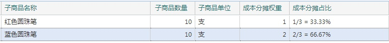

# 静态BOM中的成本分摊

---

## 成本分摊权重

在子件的数据中有一项是成本分摊权重，下面举一个具体的例子来说明如何应用成本分摊权重。

“圆珠笔套装”的静态BOM如下图所示

该静态BOM表示，1套圆珠笔套装由10支红色圆珠笔和10支蓝色圆珠笔构成。

假设一套圆珠笔套装的成本是30元。

红色圆珠笔的权重是1，这就表示10支红色圆珠笔占1套圆珠笔套装成本的1/3；
> 占比的算法：红色圆珠笔的权重 / (红色圆珠笔的权重 + 蓝色圆珠笔的权重)

这10支红色圆珠笔的成本就是 30 * (1/3) = 10元，每支红色圆珠笔成本1元。

蓝色圆珠笔的权重是2，这就表示10支蓝色圆珠笔占1套圆珠笔套装成本的2/3。
> 占比的算法：蓝色圆珠笔的权重 / (红色圆珠笔的权重 + 蓝色圆珠笔的权重)

这10支蓝色圆珠笔的成本就是 30 * (2/3) = 20元，每支蓝色圆珠笔成本2元。

从上面的例子，可以知道：权重是针对子件项下合计的。

## 应用场景

在进行存货拆分业务的时候，存货被拆分后，就根据成本分摊权重来重新分摊得出拆分后商品各自的存货成本。

