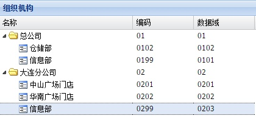
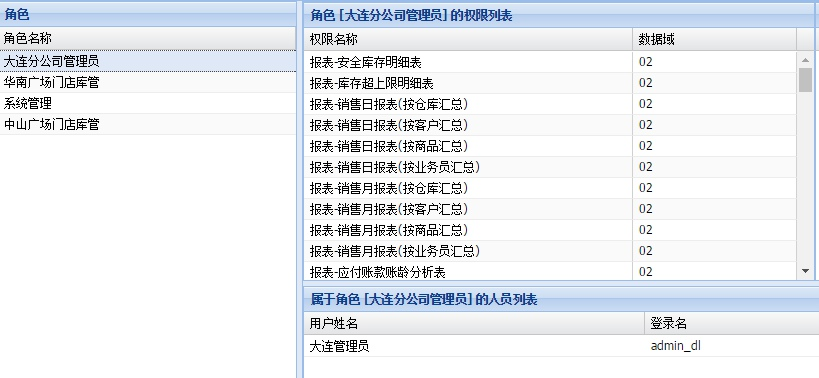
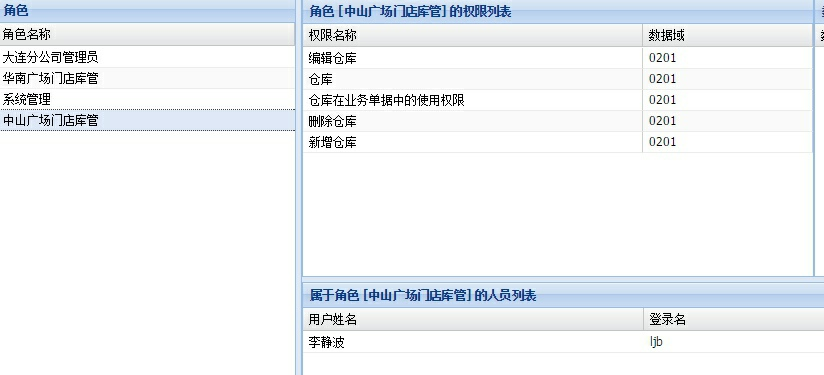
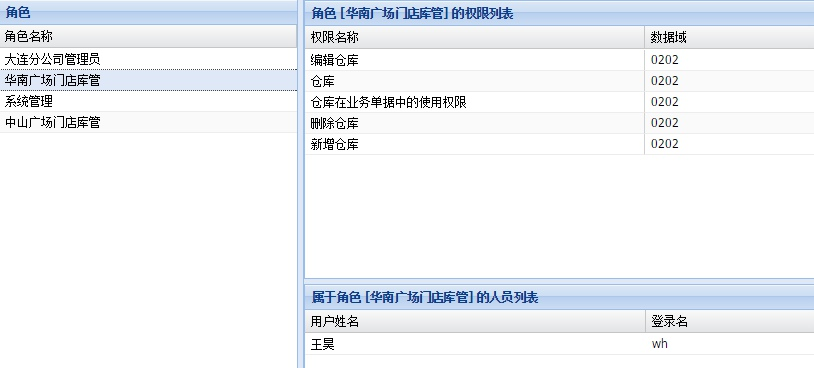
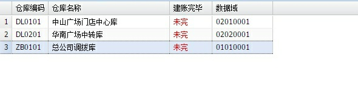
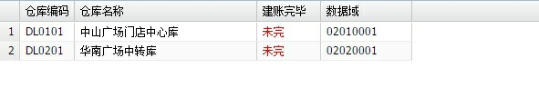
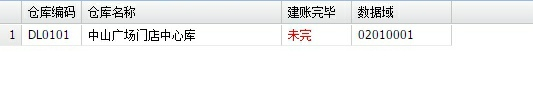

# 数据域应用详解

---

1、 数据域是为了实现数据级别的权限隔离而引入的一种方法。

2、 数据域应用的第一步，也是最重要的一步：设置正确的组织机构。 举例如下：

与之对应的人员的数据域是

<table>
    <tr>
        <th>组织机构</th>
        <th>组织机构数据域</th>
        <th>所属人员</th>
        <th>人员的数据域</th>
    </tr>
    <tr>
        <td>总公司\信息部</td>
        <td>0101</td>
        <td>admin</td>
        <td>01010001‍</td>
    </tr>
    <tr>
        <td>大连分公司\中山广场门店</td>
        <td>0201</td>
        <td>ljb（李静波）</td>
        <td>02010001‍</td>
    </tr>
    <tr>
        <td>大连分公司\华南广场门店</td>
        <td>0202</td>
        <td>wh（王昊）</td>
        <td>02020001‍</td>
    </tr>
    <tr>
        <td>大连分公司\信息部</td>
        <td>0203</td>
        <td>admin_dl（大连管理员）</td>
        <td>02030001</td>
    </tr>
</table>

3、 实施数据域，第二步是正确设置权限。

在上述案例中，可以由 admin 给 admin_dl（大连管理员）设置权限， 然后由 admin_dl给大连分公司的其他人员设置权限。 这个也是多公司多门店下的常见业务场景。

【大连分公司管理员】这个角色的权限中各个数据域都设置成了【02】，其中02代表的是大连分公司的数据域。

设置好后，admin_dl（大连管理员）登录，进入【用户管理】，就会发现现在看到的数据只是大连分公司的数据了，总公司的人员信息就看不到。再进入【权限管理】，也会发现只能看到由 admin_dl（创建的权限），而由admin创建的权限就看不见了。

上述对于用户和权限管理的数据域应用是最基础和最根本的应用，其他业务的数据域应用道理是和这个一样，只是应用了其他权限项。

4、 接着我们来看在一个公司内部应用数据域的案例。

以【仓库】这个基础数据来说明

先看权限设置

【中山广场门店库管】这个角色对应的用户是 ljb（李静波），其数据域是0201， 0201代表的是【大连分公司\中山广场门店】。

同样道理，【华南广场门店库管】是类似设置。

ljb（李静波）和wh（王昊）这个库管各自进入系统初始化自己门店的仓库数据。 

然后我们先看 admin能看到的数据

admin_dl（大连管理员）进入该模块看到的数据是

ljb（李静波）进入该模块看到的数据是

