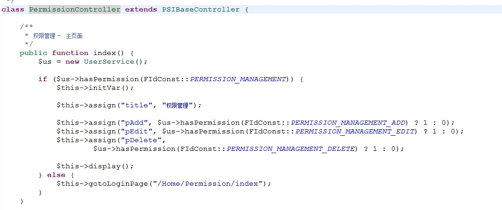

# 如何新增一个模块

---
1、fid

`fid`是功能id的缩写。一个`fid`只要做到全局唯一即可，但是最好参考PSI现在的默认命名惯例。

`fid`的定义在：[/web/Application/Home/Common/FIdConst.class.php](https://gitee.com/crm8000/PSI/blob/master/web/Application/Home/Common/FIdConst.class.php)


2、主菜单

用户进入一个业务模块的操作入口是主菜单。

PSI的主菜单定义在数据库的表 `t_menu_item` 中，表结构的具体含义请参考 [/doc/02 表结构/表结构说明.ods](https://gitee.com/crm8000/PSI/tree/master/doc/02%20%E8%A1%A8%E7%BB%93%E6%9E%84)。

`t_menu_item`中的一条记录就对应一个菜单项，所以新加一个模块，就需要向`t_menu_item`中添加一条新记录。

菜单的图标是用css实现的，该css文件在[PSI/web/Public/Content/icons.css](https://gitee.com/crm8000/PSI/blob/master/web/Public/Content/icons.css)

例如：客户资料的fid是1007，那么它的图标在css中就是这么写的
```
.PSI-fid1007 {
    background-image:url(../Images/fid/fid1007.png) !important;
}
```


3、权限

给表 `t_permission` 中新增一条记录，对应于通过菜单进入业务模块的权限。

如果页面里面的按钮也需要权限控制，有几个权限项就再定义几个fid，并向表 `t_permission` 里面新增对应的记录。


4、编写业务模块Controller

Controller需要从PSIBaseController继承。

业务模块的入口页面通常的action就用index()。

下图是PermissionController的index()的方法。



>关键技术点：
>
>1. 用UserService的方法hasPermission来判断是否有权限
>
>2. 如果没有权限用$this->gotoLoginPage来跳转页面
>
>3. 用$this->initVar()初始化默认变量值
>
>

这是标准的ThinkPHP 3.2的Controller开发内容，请参考[`ThinkPHP 3.2开发文档`](https://www.kancloud.cn/manual/thinkphp/1712)。


5、编写业务模块View

业务模块的入口页面通常的action就用index()，对应的View就是index.html

这是标准的ThinkPHP 3.2的View开发内容，请参考[`ThinkPHP 3.2开发文档`](https://www.kancloud.cn/manual/thinkphp/1785)。


6、修改MainMenuController的代码

MainMenuController 位于 [`/web/Application/Home/Controller/MainMenuController.class.php`](https://gitee.com/crm8000/PSI/blob/master/web/Application/Home/Controller/MainMenuController.class.php)

在MainMenuController的方法 `navigateTo` 中增加相应的跳转代码。
