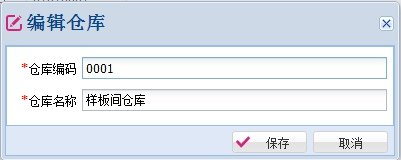
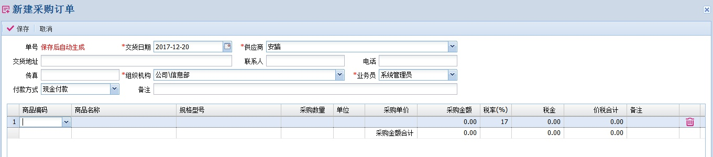
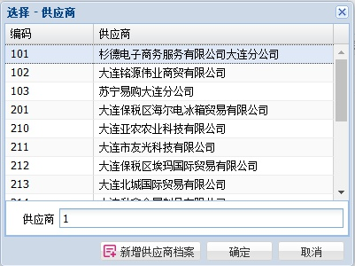

# 通用操作

---

## 表单输入中的回车键

1. 在表单输入中，在一个输入框里面按回车键后，可以跳转到下一个输入框。

2. 在最后一个输入框按回车键，可以触发默认按钮的操作。

### 1、简单表单输入的示例

这里以 `编辑仓库` 为例来说明。

1. 在 `仓库编码` 输入框中按回车键，会跳转到 `仓库名称` 输入框中。

2. 在 `仓库名称` 输入框中按回车键，会触发 `保存` 按钮的功能。

### 2、复杂的业务单据输入示例

这里以 `新建采购订单` 为例来说明。

采购订单输入界面分为两个大的部分：上面的各个输入框构成了单据的主表部分，下面的表格构成了单据的明细部分。

1. 在单据的主表部分的输入框中输入回车键后的效果和简单的表单中的效果一致，会跳转到下一个输入框。

2. 如果是在单据主表输入框的最后一个输入框中按回车键，会自动跳转到明细表格的第一列，并自动处于编辑状态。在采购订单中，主表的最后一列是 `备注`。在 `备注` 输入框中按回车键，会跳转到明细表 `商品编码` 列，并自动处于编辑状态。

3. 在明细表格的编辑框中按回车键，会跳转到下一可编辑的列中。如果是在明细表格的最后一列输入回车键，就会自动新增一条记录，并自动跳转到新增记录的第一列上。在采购订单中，明细表的最后一列是 `备注`，在该列输入框中按回车键，会自动新增一条记录，并跳转到新记录的第一列上(也就是 `商品编码` 列上)。

## 业务单据中录入基础数据

在各个业务单据中都需要引用基础数据，例如：商品、仓库、供应商、客户等等。

这是一个典型的引用供应商的输入框。
这个输入框的操作有鼠标操作和键盘操作两种方式：
1. 鼠标操作：用鼠标单击输入框右边的下拉图标。鼠标在输入框中双击也能实现同样的操作效果。
2. 键盘操作：直接在输入框中输入供应商的编码的第一个字符、名称拼音字头的第一个字符。

在实际业务中，推荐采用键盘输入，配合着回车键，能大大加快录入速度。

在上述两种操作后，都会弹出下面的界面。

在这个界面中，同样支持两种操作方式：
1. 鼠标操作：双击表格中的记录，就可以选择要引用的基础数据。
2. 键盘操作。实际操作中推荐采用键盘操作，下面详细讲解键盘操作的细节。

键盘操作的时候，要保证输入焦点在弹出框体的输入框中(在 `选择供应商` 界面中，就是 `供应商` 这个输入框)。
1. 在输入框中输入编码、拼音字头，上面的表格中的数据自动过滤查询出结果。
2. 在输入框中按 UP键(方向键向上键) 和 DOWN键(方向键向下键)，上面的表格中当前选择记录随之跟着变动。
3. 在输入框中按回车键，当前窗体关闭，并把表格中的当前记录选中，返回到业务单据的输入框中。

有了上述三种操作，在录入业务单据的时候，可以不依赖鼠标来操作，从而加快录入速度。

上述操作对于业务单据中明细表中的引用基础数据同样适用。例如：在业务单据明细表中最常见的就是引用商品这个基础数据。

## 列表中的鼠标双击操作

在PSI中，如果列表数据所对应的业务对象可以被编辑，那么用鼠标双击具体的记录，就可以打开对应的编辑窗体。

例如，在`用户管理`模块中，双击人员列表，就能打开编辑用户的窗体。
