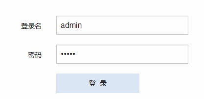

# 登录

---

登录PSI需要输入用户登录名和登录密码。

输入登录名和密码之后，单击登录按钮就能登录PSI。

>PSI安装后默认的超级管理员是admin，超级管理员的默认登录密码是admin

## 键盘操作

输入完登录名，按回车键就可以跳转到密码输入框，输入完密码再按回车键就自动触发登录按钮的功能。

这种通过回车键跳转的操作方式适用于PSI中的所有表单界面。

更多信息参见 [`通用操作`](00.md)
