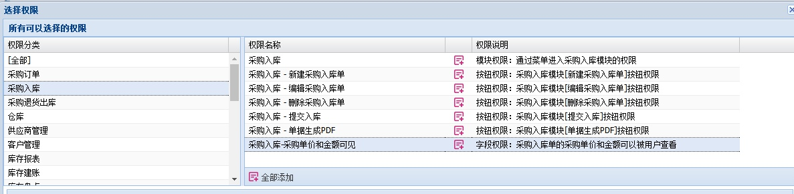

# 采购入库

---

## 新建采购入库单

采购入库单既可以从采购订单生成又可以直接录入。

直接录入通常用于没有采购订单的业务场景下，这个时候直接新建采购入库单即可。

新建的采购入库单上的入库数量会记录在库存账上的在途库存里面，提交入库后才转为实际库存。

## 编辑采购入库单

在没有提交入库之前，采购入库单可以被编辑修改。

## 查看采购入库单

提交入库后，采购入库单就只能查看而不能被编辑修改了。

## 删除采购入库单

没有提交入库的采购入库单可以删除。一旦提交后，就不能从系统汇中删除。

## 提交入库

提交入库后，会修改库存账上的存货数据。

## 自动拆分
采购入库单里面有“自动拆分”这个业务数据项，用来控制采购入库单提交后是否自动进行存货拆分业务。
1. 不自动执行拆分业务。当提交采购入库单后，业务到此完成，不会拆分存货。

2. 生成拆分单并执行。当提交采购入库单后，系统自动生成相应的拆分单，并提交拆分单完成存货拆分业务。

> 注意：物料能拆分的前提是该物料有子物料。如果入库的物料没有子物料，在生成的拆分单中就不会有该物料。如果所有的入库物料都没有子物料，那么即使是设置了自动拆分，也不会生成拆分单。

存货拆分的更多信息，请参考：[存货拆分](60-01.md)

## 单据生成PDF文件

采购入库单可以生成PDF文件供打印使用。

## 条码录入

采购入库单的录入支持条码录入。

把录入焦点置于 `条码录入` 处，用扫描枪扫描就能录入物料。

物料的条码信息在 [`物料`](02-04.md)模块中维护

## 控制采购金额和单价可见

有一个常见的业务场景是：希望部分库管人员不能看见采购单价和金额。

这是时候就需要使用字段权限：采购入库-采购单价和金额可见

拥有该权限的用户，就可以正常查看入库单上的采购单价和金额。

如果用户没有该权限，就会有如下限制：
1. 不能新建采购入库单。
2. 编辑采购入库单的时候，看不到采购金额和单价，也不能编辑采购金额和单价。
3. 编辑采购入库单的时候，不能增加新的物料入库记录。

## 打印

PSI集成了Lodop打印功能，详细说明见：[`Lodop打印`](07.md)
