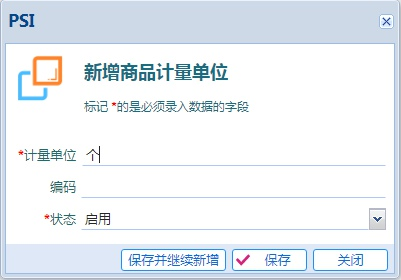
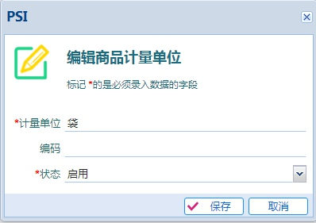

# 物料计量单位

---

物料计量单位是物料的属性之一。

在 `物料计量单位` 模块可以新增、编辑、删除物料计量单位。

如果一个计量单位在物料中已经使用了，就不能被删除，但是可以修改它的名称。

## 新增物料计量单位

单击工具栏上的按钮 就能打开新增界面。

> 计量单位的编码仅仅用于显示排序，可以不用输入

## 编辑物料计量单位

先选择要编辑的物料计量单位，然后单击工具栏上的按钮 就能打开编辑界面。

> 在编辑界面可以把不需要的计量单位停用

## 删除物料计量单位

先选择要删除的物料计量单位，然后单击工具栏上的按钮 

如果一个计量单位在物料中已经使用了，就不能被删除，但是可以把它的状态修改为停用。
