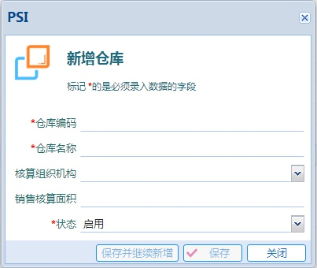
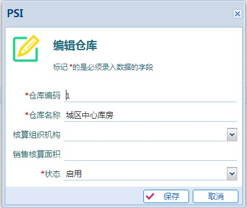

# 仓库

---

仓库是核心的基础数据，初始化仓库是实施PSI的基础工作。

仓库在基础数据中创建后，需要进一步在 [`库存建账`](02-06.md) 中完成建账后仓库才能在业务中启用。

## 新增仓库

单击工具栏中的  按钮后系统会弹出新增仓库操作窗体。

| 字段名称  | 说明           |
| -------- |-------------|
| 仓库编码  | 仓库编码需要保证编码唯一，建议长度不要超过10位 |
| 仓库名称  | 仓库名称，长度不要超过20个汉字      |
| 核算组织机构  | 用于核算的时候，指定该仓库属于哪个组织机构。 应用举例：按门店统计出库情况的时候，把核算组织机构设置为各个门店      |
| 销售核算面积  | 用来统计[每平方米销售额]     |
|用途|仓库的用途分为四类：原材料库、半成品库、产成品库和商品库。 因为物料类型也分为原材料、半成品、产成品和商品这四类，所以仓库的用途和物料类型是一一对应的|
|物料限制|物料限制是配合仓库的用途一起使用的。当仓库启用了物料限制，该仓库中的物料类型就只能保存用途中的那类物料。例如：用途是原材料库，入库的时候，非原材料的物料就不能入库到该仓库。 通常建议启用物料限制，因为在一个仓库中混合存放不同类型的物料不是很好的管理方法。|

>仓库业务字段说明

  

录入完`仓库编码`，在输入框里按回车键会自动跳转到`仓库名称`输入框，在`仓库名称`录入完后继续跳转，在`销售核算面积`按回车键会自动触发`保存并继续新增`按钮的单击功能。

>这样的回车键跳转输入框，以及在最后一个输入框回车触发提交按钮的操作，是PSI中的操作惯例。

## 编辑仓库

在仓库列表中选中要编辑的仓库，然后单击按钮，就会弹出表单来编辑仓库。

编辑仓库的表单操作和新增仓库的表单操作类似。

## 删除仓库

一旦仓库在业务中启用，就不能从系统中删除。

在仓库列表中选中要删除的仓库，然后单击按钮。系统会自动判断仓库是否可以删除。

## 修改仓库的数据域

在仓库列表中选中仓库，然后单击按钮，系统会弹出表单来修改仓库数据域。

在实施中经常出现这样的错误：仓库由系统管理员admin创建，这样在实施数据权限的时候就会遇到麻烦。

通过修改仓库的数据域，就能把仓库的创建人设置成其他业务员，从而进一步实现数据权限的管理。

数据域的应用，参见 [`数据域应用详解`](05.md)

## 打开库存建账模块

单击按钮可以进入库存建账模块。

从主菜单也能进入库存建账模块，这里增加按钮是方便新用户使用。

>如果当前登录的用户没有库存建账模块的功能权限，用户就看不见该操作按钮。

## 仓库状态

仓库的状态包括：启用和停用。

当一个仓库被停用后，在业务单据的录入界面中就不能再选择该仓库。

## 仓库用途和物料限制

仓库用途分为：原材料库、半成品库、产成品库和商品库这四种。

物料限制配合着仓库用途使用。当启用了物料限制的时候，会根据仓库的用户限制业务单据中物料。

例如：当仓库的用途是原材料库、并且该仓库启用了物料限制的时候，采购入库单的物料明细中的物料就只能是原材料（注：物料的物料类型也分为原材料、半成品、产成品和商品四种，和仓库用途一一对应）。

当不启用物料限制的时候，不管仓库用途是什么，都可以录入任意类型的物料。这种业务场景适用于管理还不太规范的过渡期。
